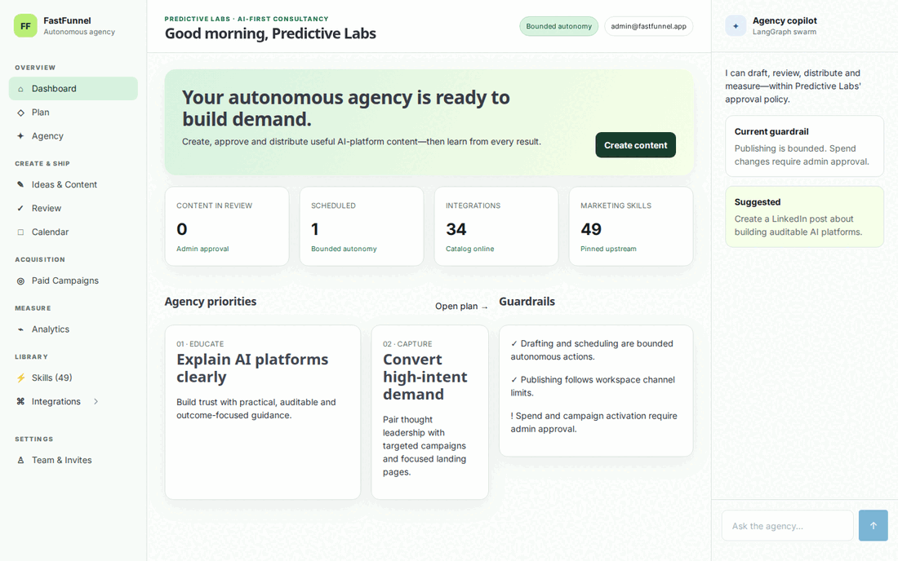

# FastFunnel

FastFunnel is an Apache-2.0, FastHTML-based autonomous marketing cockpit. It is
designed to create, review, distribute, measure, and improve marketing work
while keeping publishing and spend inside explicit company guardrails.

The initial dogfood workspace is [Predictive Labs](https://predictivelabs.ai),
an AI-first platform consultancy. `admin@fastfunnel.app` is seeded as the
approving demo administrator.



## What works now

- Light three-pane FastHTML cockpit with a distinct FastFunnel identity.
- Organization/company/user/membership/invitation persistence.
- Content draft → admin review → bounded autonomous scheduling.
- Configurable, cohort-based digital acquisition funnels with conserved Sankey
  progression and drop-off reporting.
- Idempotent synthetic Google Ads ingestion into normalized campaign facts,
  with sync freshness, run history, a working campaign portfolio, and durable
  manual refresh jobs.
- Replayable HubSpot, Brevo, and GA4 source adapters with immutable raw
  extracts, source accounts, cursors, and normalized lifecycle records.
- Tenant-editable Marketing Skills overlays that preserve the pinned upstream
  library and version every workspace customization.
- Governed content generation and social-publication proposals with exact
  payload approvals, durable idempotency, worker execution, and receipts.
- Composio and Arcade delegated execution adapters. They remain unconnected
  until API keys and per-user connected-account references are supplied.
- KPI Explorer plus Google Sheets and allow-listed FastSheets/FastInsights
  destination contracts. FastOffice remains visible as a stub until its sister
  repository exposes a token-gated artifact API.
- SQLite-backed durable job queue and a separate `python -m fastfunnel.worker`
  process for background connector work.
- Persisted xAI/LangChain agency conversations and 30-day operating plans,
  grounded in tenant content, campaign, funnel, and KPI facts. The deterministic
  LangGraph policy contract remains covered by evals.
- Complete vendored Marketing Skills catalog: 49 skills at pinned upstream
  commit `7868cb9251fad80a73d26e488a5ad5f6c4a9f335`.
- Thirty-four registry-driven integration pages including Google, Meta,
  LinkedIn, Instagram/Facebook, X, Buffer, Composio, Arcade, analytics, CRM,
  email, data, and MCP options.
- Honest stubs for Bluesky, Mastodon, and unfinished providers.
- Synthetic/local operation without API credentials.

Live social publishing stays disabled until a tenant connects Composio or
Arcade and approves an exact content payload. Google Ads live transport remains
an honest stub. GA4, HubSpot, and Brevo remain unconnected until deployment
secrets are supplied.

## Run locally

```bash
cp .env.sample .env
uv sync --extra dev
uv run python -m fastfunnel.app
```

Open <http://127.0.0.1:5005>.

Run one queued background job, or start the polling worker:

```bash
uv run python -m fastfunnel.worker --once
uv run python -m fastfunnel.worker
```

Run the quality gate:

```bash
uv run ruff check .
uv run python -m compileall -q fastfunnel tests
uv run pytest -q
```

Validate real Composio and Arcade project keys with read-only API calls:

```bash
RUN_LIVE_INTEGRATION_TESTS=1 uv run pytest -q tests/test_live_integrations.py
```

Docker:

```bash
docker compose up --build
```

## Demo GIF

With the app running:

```bash
uv run playwright install chromium
uv run python scripts/capture_demo.py
bash scripts/build_demo_gif.sh
```

## Documentation

- [Comprehensive implementation plan](docs/IMPLEMENTATION_PLAN.md)
- [Current architecture](docs/ARCHITECTURE.md)
- [Backend architecture and data flows](docs/architecture_readme.md)
- [Marketing Skills attribution](third_party/marketingskills/UPSTREAM.json)
