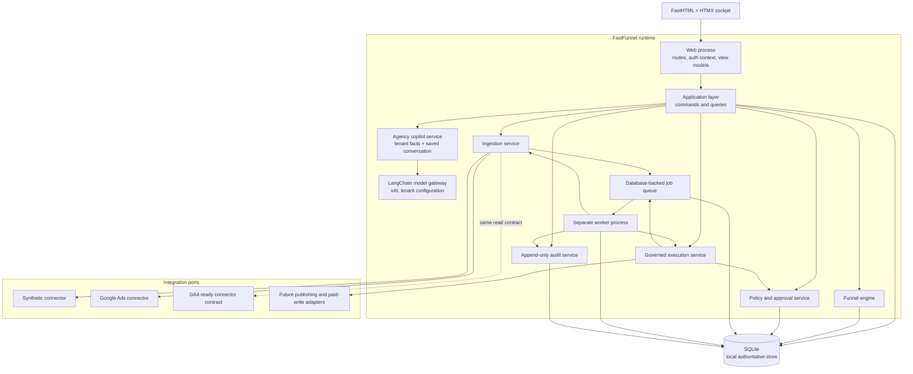
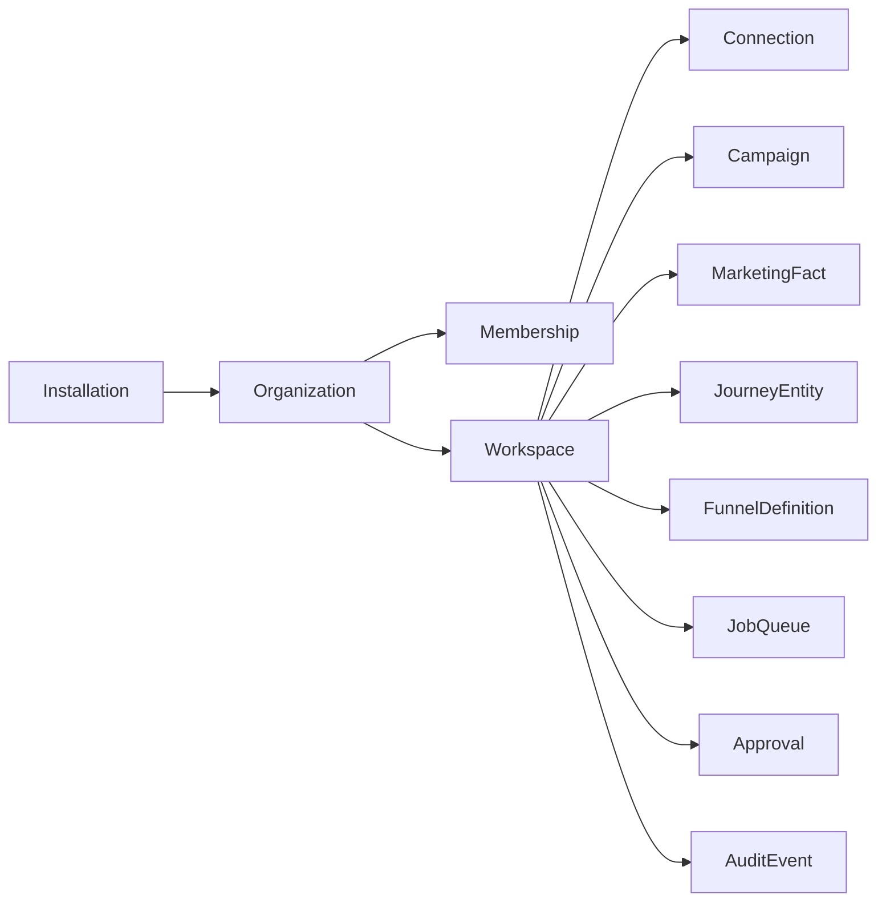
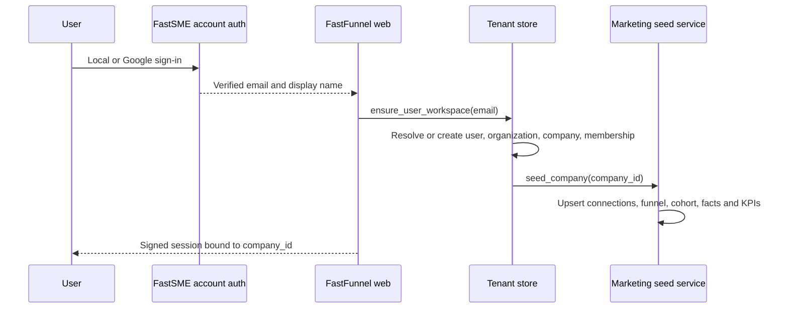
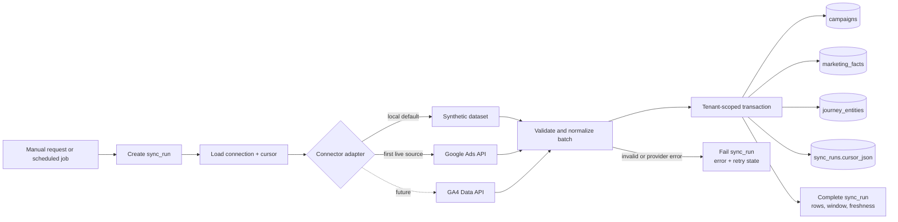
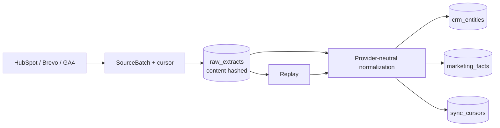
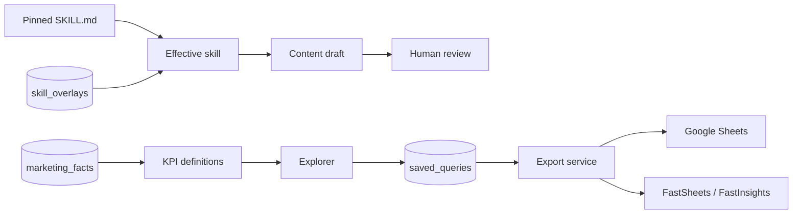
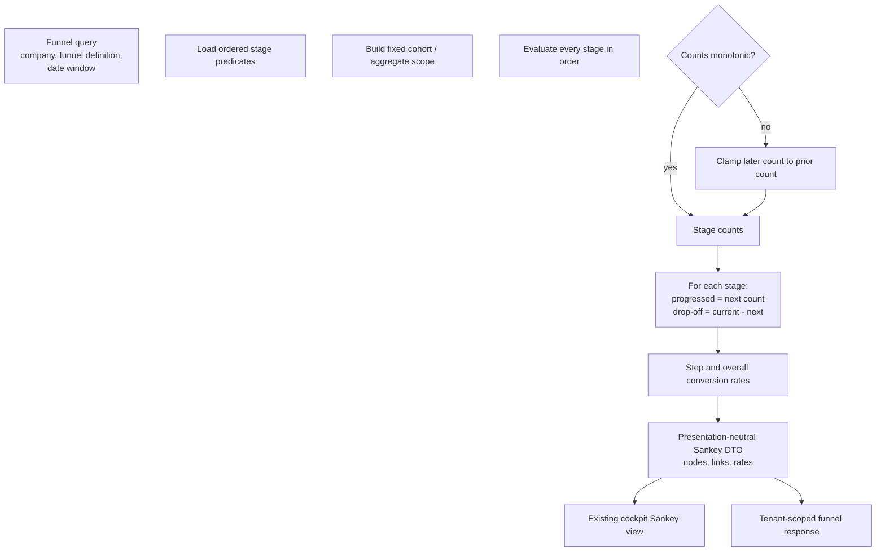
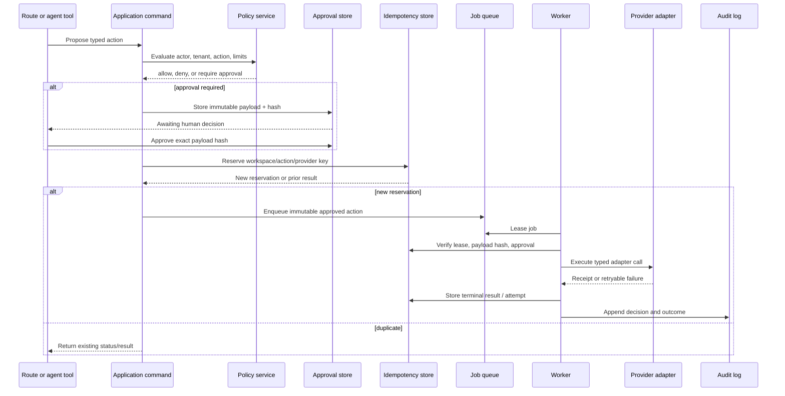
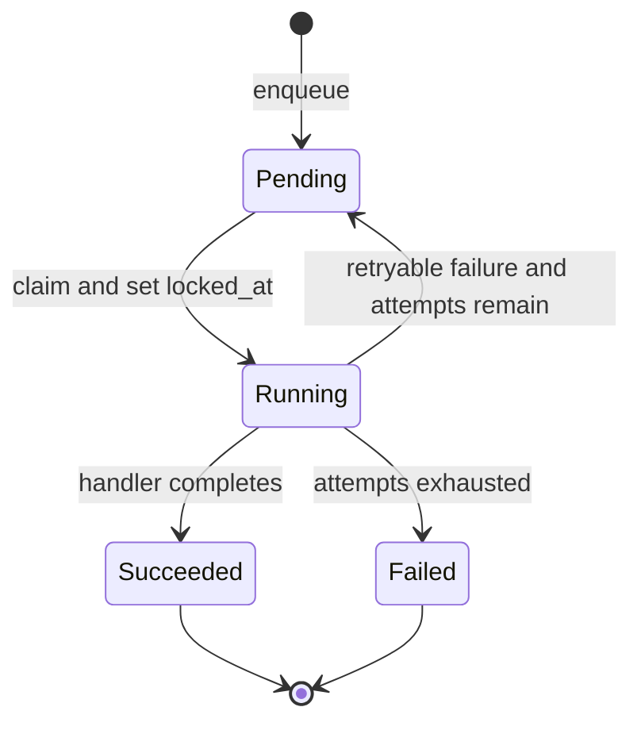

# FastFunnel backend architecture

This document is the engineering reference for FastFunnel's first functional
vertical slice. It describes the target that the current implementation is
moving toward, not a claim that every production capability is already live.

The current slice deliberately uses SQLite and deterministic synthetic
marketing data so the entire product works without provider credentials.
HubSpot, Brevo, and GA4 implement live HTTP transports behind injectable
contracts; Google Ads live transport remains pending. Funnels are data, not
hard-coded pages: a workspace can create and edit ordered stage definitions.

## Scope and decisions

The first slice provides:

- a modular-monolith backend behind the existing FastHTML cockpit;
- organization and workspace isolation on every business record and query;
- versioned SQLite migrations and repeatable synthetic seed data;
- normalized campaign, daily metric, journey-entity, and sync-run storage;
- configurable cohort funnels with a six-stage digital-marketing default;
- a conserved Sankey graph with conversion and drop-off values;
- a database-backed job queue processed by a separate worker;
- a connector boundary with synthetic, Google Ads, and GA4-ready adapters;
- replayable HubSpot, Brevo, and GA4 ingestion with immutable raw extracts;
- tenant-editable overlays over the immutable pinned Marketing Skills library;
- tenant-scoped xAI model preferences behind a LangChain `ChatXAI` boundary;
- a persisted, tenant-grounded xAI copilot and 30-day operating-plan service
  that remains advisory and cannot call provider writes;
- a marketing-plan read model composed from current normalized KPIs, the active
  workspace funnel, and persisted agency runs rather than fixed presentation data;
- a typed KPI explorer and Google Sheets/FastSME destination boundary;
- Composio and Arcade execution adapters with encrypted per-tenant project
  keys and per-tenant/user connected-account identities;
- the existing approval and audit boundary, with durable provider-action
  idempotency required before external mutations are enabled;
- a UI kept visually close to the existing cockpit while replacing static
  values with backend queries.

The initial environment is intentionally local-first. SQLite is authoritative,
synthetic mode is safe and useful, and no Google credential is required to
exercise the product. External publication and paid-media writes remain behind
the governed mutation boundary and must never be called directly by a route,
prompt, or agent tool.

## Modular-monolith architecture

The application is one deployable Python codebase with a web process and a
worker process. Modules communicate through typed application commands and
queries. They share a database, but a module does not reach through another
module's service boundary to perform a write.



The implemented first-slice package boundaries are:

```text
fastfunnel/
├── app.py                    # composition root and FastHTML entry point
├── config.py                 # environment-derived settings
├── web/                      # routes, components, view models, SSE
├── domain/
│   ├── store.py              # SQLite connection, identity/content, audit
│   ├── schema.py             # versioned operational marketing schema
│   ├── marketing.py          # ingestion, read models, seed, queue operations
│   ├── ingestion.py          # raw extracts, cursors, replay, normalization
│   ├── analytics.py          # KPI semantics, explorer, saved queries, exports
│   ├── content.py            # skill-grounded draft creation
│   ├── agency.py             # persisted tenant-grounded copilot and plans
│   ├── models.py             # LangChain/xAI model boundary
│   ├── workspace.py          # model preferences and encrypted key vault
│   ├── actions.py            # governed external action lifecycle
│   └── funnels.py            # funnel evaluator and Sankey projection
├── integrations/
│   ├── marketing.py          # connector contract, Google Ads, GA4
│   ├── sources.py            # HubSpot, Brevo, and GA4 transports
│   ├── destinations.py       # Google Sheets and FastSME exports
│   ├── execution.py          # Composio and Arcade delegated execution
│   ├── registry.py           # honest integration capability registry
│   └── postmark.py           # transactional email adapter
├── agents/                   # typed application tools only
├── worker.py                 # worker process entry point
└── runtime.py                # production web + worker process supervisor
```

These modules form the current modular-monolith seam. As the application layer
is split further, web and agent code must continue to call tenant-aware domain
services instead of provider writes. SQL stays behind `domain/store.py`,
`domain/schema.py`, and the domain services that own the current persistence
operations.

## Tenant and request boundaries

FastFunnel models an installation containing organizations, each of which owns
one or more workspaces (the existing `companies` concept is the first workspace
representation).



Every command and query receives an explicit request context:

```text
actor_id + organization_id + workspace_id + role
```

The following invariants apply even when the local demo exposes only one
workspace:

1. A business row carries both `organization_id` and `workspace_id`, or reaches
   them through an enforced foreign-key relationship. The current schema uses
   `company_id` as the workspace key.
2. Repository methods require a tenant scope; selecting the first organization
   or workspace is not application behavior.
3. The actor must be an active member of the organization.
4. Cross-workspace connection sharing is explicit, never implicit.
5. Unique/idempotency keys include the workspace boundary.
6. Audit records preserve the actor and tenant context of the operation.

SQLite cannot provide production row-level security, so the application and
repository tests enforce these constraints now. A later Postgres
implementation adds row-level policies as defense in depth.

Shared FastSME authentication proves account identity; it does not implicitly
grant access to a FastFunnel tenant. The login callback therefore provisions or
resolves exactly one product workspace, records its `company_id` in the signed
session, seeds that workspace's synthetic sources and default funnel
idempotently, and then validates membership on every protected request.



Provisioning IDs and provider entity IDs include the tenant boundary. Repeated
login and process startup are safe, and demo-identity refresh targets only the
configured demo administrator's organization rather than an arbitrary first
row.

## Marketing ingestion and normalized data

Connectors implement the provider-neutral `MarketingReadConnector` contract in
`integrations/marketing.py`. A connector reports readiness and fetches a bounded
inclusive date window:

```text
readiness() -> tuple[state, reason]
fetch(start, end) -> tuple[list[CampaignRecord], list[FactRecord]]
```

The implemented connector returns normalized `CampaignRecord` and `FactRecord`
values for an inclusive date window. `domain/marketing.py` owns the sync run,
upserts the returned campaigns and facts, and stores the completed window in
`sync_runs.cursor_json`. `journey_entities` supplies deterministic,
person-shaped cohort progress for the funnel. Provider-specific values may be
retained in JSON dimensions, but reporting does not depend on provider-shaped
dictionaries.



Writes are repeatable. Reprocessing the same provider/account/date window
updates the same normalized records rather than inserting duplicates. A
recommended natural fact identity is:

```text
workspace_id, source, external_account_id, date,
campaign_key, ad_group_key, ad_key, metric, dimensions_hash
```

Synthetic rows use stable identifiers and a fixed seed, so screenshots and
tests are deterministic. Synthetic and live data are visibly labelled and
never silently mixed in a connection.

### Google Ads and GA4

Google Ads is the first live-connector target and is read-only. Its currently
executable mode is the synthetic transport, providing campaigns plus daily
impressions, clicks, spend, and conversions. Live mode advertises `connected`
only when the required environment credentials are present; its network
transport must still remain disabled honestly until implemented. Before that
the integration is `available`; an unimplemented adapter is `stub`.

GA4 implements the same `MarketingReadConnector` lifecycle and normalized
campaign/fact return shape. GA4-specific dimensions will map into the common
fact and journey-entity model so adding keys later does not require changing
the funnel engine or cockpit query contract. Until it is connected, seeded
`journey_entities` supply the complete funnel cohort.

### Replayable sources and lifecycle data

`SourceConnector` extends the first campaign-only contract with an account,
cursor, raw records, and provider timestamps. `domain/ingestion.py` persists
canonical payloads in `raw_extracts` before normalization and advances a
per-source cursor only after the batch succeeds. Content hashes make repeated
partitions idempotent and allow normalized tables to be rebuilt by replay.

HubSpot normalizes contacts and lifecycle stages into `crm_entities`. Brevo
normalizes contacts plus campaign delivery, open, and click metrics. GA4
normalizes report rows. Their live HTTP transports are dependency-injected, so
tests exercise provider request contracts without using credentials.



## Skills, content, KPIs, and destinations

The vendored `third_party/marketingskills/` snapshot is immutable.
`skill_overlays` stores tenant enablement, additional instructions, actor, and
version. Runtime instructions compose upstream text, the overlay, and grounded
workspace context. Draft generation has no external side effect and records the
skill overlay version used.

`kpi_definitions` stores reusable numerator/denominator semantics. Explorer
queries accept only allow-listed metrics and dimensions. Saved query
definitions can feed Google Sheets or the allow-listed FastSheets and
FastInsights API hosts; every delivery is recorded in `export_runs`. FastOffice
remains an honest stub until its repository exposes a token-gated artifact API.



The token-gated `/api/mcp` JSON-RPC gateway exposes KPI and funnel reads plus
an activation-proposal tool. Workspace API tokens are random, stored only as
hashes, tenant-bound, expiring, and revocable. Tenant identity comes from the
token principal rather than caller-supplied `company_id` or actor fields. The
activation tool can propose publication, conversion upload, or audience
synchronization, but it cannot execute them; the normal approval and worker
sequence remains mandatory.

## Configurable funnel and Sankey calculation

The shipped default is a digital-marketing funnel with no meeting stage:

1. Impressions
2. Clicks
3. Engaged visits
4. Leads
5. Qualified leads
6. Customers

This is a template, not special-case Sankey code. A `funnel_definitions` row
owns ordered `funnel_stages`; each stage stores its labels and a JSON predicate.
The implemented predicate is `minimum_stage`, evaluated against
`journey_entities.reached_stage` within the selected observation window.
Additional predicate types and definition version history can be added behind
the same presentation contract.

Funnel evaluation uses one cohort and reporting window. It does not compare
unrelated lifetime totals. A later stage is reached by an entity from the
earlier cohort in stage order. `domain/funnels.py` also clamps cumulative input
to non-negative, monotonically decreasing counts before constructing links.



For adjacent stages `i` and `i + 1`:

```text
progressed(i) = count(i + 1)
drop_off(i)   = count(i) - count(i + 1)
count(i)      = progressed(i) + drop_off(i)
step_rate(i)  = count(i + 1) / count(i)
overall_rate  = final_count / first_count
```

Required funnel invariants:

- counts and link values are non-negative integers;
- stage order follows `funnel_stages.position`;
- outgoing Sankey flow from a stage conserves its count;
- an empty stage makes all later identity-mode stages empty;
- divide-by-zero rates are represented safely;
- observation window and definition metadata accompany results;
- a node or link can be traced to qualifying journey entities;
- the calculation layer does not emit HTML or chart-library objects;
- identical inputs and stored data produce identical output.

## Governed external mutations

Provider reads may run through ingestion jobs. Provider writes—publishing,
campaign creation, enable/pause, budget changes, audience uploads, and similar
actions—must follow the full governed execution path.



Approval belongs to the exact canonical payload hash. Editing the destination,
budget, content, schedule, or other material field produces a new proposal and
invalidates the old approval. Idempotency is durable across process restarts
and provider timeouts. Every provider attempt and reconciliation result is
audited.

No route, prompt, LangGraph node, or UI component may import and invoke a
provider write client directly.

## Worker lifecycle

The separate worker uses the same application composition root and database as
the web process. SQLite queue claims use short transactions; provider network
work occurs outside the claim transaction.



Each `job_queue` row stores company scope, job type, payload, idempotency key,
status, attempt count, maximum attempts, availability time, lock time,
completion time, and last error. The current worker handles
`sync.google_ads`, `sync.ga4`, `sync.hubspot`, `sync.brevo`, and
`action.execute`; unknown kinds fail visibly.

The worker lifecycle is:

1. select one eligible pending job and transition it to `running`;
2. increment its attempt count and record `locked_at`;
3. execute the typed sync or governed-action handler outside the claim transaction;
4. transition it to `succeeded` and store `finished_at`; or
5. store `last_error` and return it to `pending` while attempts remain,
   otherwise transition it to `failed`.

## Key persistent records

The following names match the current SQLite schema.

| Record | Purpose and important constraints |
| --- | --- |
| `organizations` | Top-level tenant boundary. |
| `companies` | Current workspace/client scope, timezone, currency, and profile. |
| `users`, `memberships` | Actor identity and organization role. |
| `integration_connections` | Provider, capability, honest state, account binding, secret reference; never raw credentials. |
| `workspace_settings` | Tenant-selected model provider, model name, and temperature. |
| `integration_secrets` | Fernet-encrypted Composio/Arcade project keys, validation state, and non-secret fingerprint. |
| `api_tokens` | Hashed, expiring, revocable workspace API principals; raw tokens are shown once. |
| `platform_accounts`, `data_sources` | Provider account hierarchy and tenant source configuration. |
| `sync_cursors`, `raw_extracts` | Incremental watermarks and immutable replay input. |
| `sync_runs` | Source, requested window, status, counts, freshness, cursor, and error. |
| `crm_entities` | HubSpot/Brevo contacts, lifecycle stages, and revenue properties. |
| `campaigns` | Normalized campaign identity and provider metadata. |
| `marketing_facts` | Long-form daily metrics with currency and typed dimensions. |
| `agency_messages` | Per-workspace, per-user copilot history; prompts contain summarized tenant facts, never credentials. |
| `agency_runs` | Saved advisory operating plans with actor, goal, result, and status. |
| `journey_entities` | Dated, campaign-attributed cohort entities with their highest reached stage. |
| `funnel_definitions` | Workspace-owned funnel metadata and active version. |
| `funnel_stages` | Ordered labels and JSON predicates belonging to a funnel definition. |
| `job_queue` | Durable background work, idempotency key, attempts, timing, lock, and last error. |
| `approvals` | Exact canonical payload and hash, requester/decider, status, and expiry. |
| `action_requests`, `action_executions` | Governed mutation, durable idempotency, attempts, and receipts. |
| `skill_overlays` | Tenant skill enablement and versioned instructions. |
| `kpi_definitions`, `saved_queries` | Semantic KPIs and reusable explorer definitions. |
| `destination_connections`, `export_runs` | Export configuration, status, and delivery receipts. |
| `audit_events` | Append-only actor, tenant, event, object, decision, and details. |

The mutation schema implements `action_requests` and `action_executions` in
addition to `approvals` and `audit_events`. Composio and Arcade credentials are
accepted only after a read-only provider validation, encrypted using
`FASTFUNNEL_ENCRYPTION_KEY`, and never returned to a view model or audit event.
They execute only from the worker after membership, exact-payload approval,
tenant identity, and prior-success checks pass.

Foreign keys, WAL mode, and a busy timeout are enabled for every SQLite
connection so the web and worker processes can share the durable store.
Schema versions are recorded monotonically; an explicit migration runner
remains a required hardening step before replacing the current idempotent DDL
bootstrap.

## System invariants

These rules define a functional backend:

1. **Tenant isolation:** no unscoped business query or command.
2. **Honest integrations:** internal `stub`, `available`, and `connected`
   states describe executable reality; the UI renders `stub` as
   **Coming soon**.
3. **Repeatable ingestion:** the same source partition and cursor cannot create
   duplicate facts.
4. **Provenance:** every displayed metric can identify source, sync run, source
   timestamp, and synthetic/live status.
5. **Funnel conservation:** every Sankey stage count equals its progressed plus
   drop-off flows.
6. **Immutable approval:** approval applies only to the hashed action payload.
7. **At-most-once effect:** retries and duplicate requests cannot repeat a
   provider mutation.
8. **Auditability:** policy decisions, approvals, attempts, and results are
   append-only business events.
9. **Restart safety:** syncs, jobs, and actions recover from process restart.
10. **UI independence:** charts consume application DTOs and do not calculate
    business truth in route/component code.

## Local development

Install and validate the repository with:

```bash
uv sync --extra dev
uv run python -m compileall -q fastfunnel tests
uv run ruff check .
uv run python -m pytest -q
```

Run the web cockpit:

```bash
uv run python -m fastfunnel.app
```

It listens on port `5005` by default. The SQLite location is controlled by
`FASTFUNNEL_DB_PATH` and defaults to `data/fastfunnel.sqlite3`. Production
additionally requires `FASTFUNNEL_SESSION_SECRET`; tenant Composio/Arcade
credential storage requires `FASTFUNNEL_ENCRYPTION_KEY`.

Run the worker in a separate terminal:

```bash
uv run python -m fastfunnel.worker
```

The default boot path migrates the database and loads deterministic synthetic
marketing data. Re-running setup must be safe. Local UI verification uses
Playwright against `http://127.0.0.1:5005` and covers at least:

- dashboard and funnel pages render without console errors;
- the Sankey graph uses backend data and preserves its existing visual shape;
- changing date/filter inputs updates counts and rates;
- node/link drill-down returns tenant-scoped source records;
- a sync job reaches a terminal state in the worker;
- unavailable Google Ads and GA4 connections are not shown as connected.

Generated databases, provider credentials, `.env` files, and captured test
artifacts are not committed.

## Production evolution

The local architecture is designed to evolve without changing domain
contracts:

1. Replace SQLite repositories with Postgres implementations and add database
   row-level security.
2. Replace SQLite queue leasing with a production queue while retaining job
   handler and idempotency contracts.
3. Store encrypted OAuth refresh tokens in a secret manager; database records
   retain only references and connection metadata.
4. Enable Google Ads live read sync after credential validation, then add GA4
   using the existing `MarketingReadConnector` contract.
5. Add immutable raw extracts/object storage for replay, backfill, and schema
   drift analysis.
6. Add webhook signature verification, replay protection, reconciliation, and
   provider-specific rate limiting.
7. Add structured logs, metrics, job-lag alerts, connector freshness alerts,
   backups, retention, deletion, and disaster-recovery procedures.
8. Introduce live provider mutations one action class at a time, with adapter
   contract tests and default dry-run or paused behavior.

The production image supervises the web and worker as separate OS processes in
one container so both share the same mounted SQLite volume. Docker Compose may
run the same entry points as two services using its shared named volume. A
release is healthy only when initialization has completed, the web health
check passes, the worker is polling, queue lag is bounded, and the synthetic
smoke funnel produces a conserved graph.

## Definition of done for the first slice

The vertical slice is complete when a clean checkout can initialize SQLite,
load synthetic data, start web and worker processes, execute an idempotent sync,
and display the configurable default funnel through the existing cockpit UI.
Tests must prove tenant isolation, ingestion repeatability, funnel conservation,
worker recovery, exact-payload approval, and duplicate mutation protection.
Google Ads must have an executable read adapter or accurately report its
unconnected/available state; GA4 must be addable through the documented
connector contract without changing the funnel engine.
