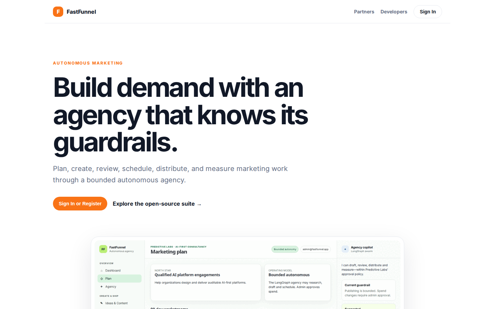
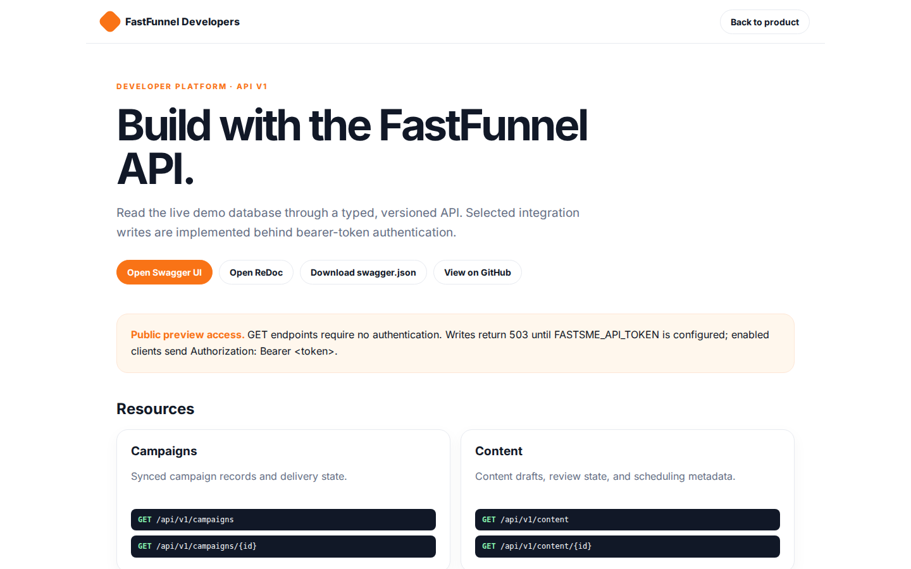

# FastFunnel Platform Guide

**Published:** 2026-08-19
**Platform:** [https://funnel.fastsme.com](https://funnel.fastsme.com)
**Source:** [github.com/predictivelabsai/FastFunnel](https://github.com/predictivelabsai/FastFunnel)

## Platform overview

FastFunnel is an Apache-2.0, FastHTML-based autonomous marketing cockpit. It is designed to create, review, distribute, measure, and improve marketing work while keeping publishing and spend inside explicit company guardrails.

This visual guide was reviewed against the live product using Playwright. Screens and available navigation can vary by account, role, and deployment configuration.

## 1. Build demand with an agency that knows its guardrails.

AUTONOMOUS MARKETING Build demand with an agency that knows its guardrails. Plan, create, review, schedule, distribute, and measure marketing work through a bounded autonomous agency. Sign In or Register Explore the open-source suite → Product tour · see the w

Screen reviewed at: [https://funnel.fastsme.com/](https://funnel.fastsme.com/)

## 2. Build with the FastFunnel API.

FastFunnel Developers Back to product DEVELOPER PLATFORM · API V1 Build with the FastFunnel API. Read the live demo database through a typed, versioned API. Selected integration writes are implemented behind bearer-token authentication. Open Swagger UI Open Re

Screen reviewed at: [https://funnel.fastsme.com/developers](https://funnel.fastsme.com/developers)

## 3. Sign in

Sign in with Google Sign in to continue to fastsme.com Email or phone Forgot email? Next Create account Afrikaans azərbaycan bosanski català Čeština Cymraeg Dansk Deutsch eesti English (United Kingdom) English (United States) Español (España) Español (Latinoam

Screen reviewed at: [https://accounts.google.com/v3/signin/identifier?opparams=%253F&dsh=S2031359774%3A1787122753098893&access_type=online&client_id=887059023987-2a7spj1m82eivobdbt1itb3cqca6tpt1.apps.googleusercontent.com&o2v=2&prompt=select_account&redirect_uri=https%3A%2F%2Ffunnel.fastsme.com%2Fauth%2Fgoogle%2Fcallback&response_type=code&scope=openid+email+profile&service=lso&state=2jloWGMj7WcLhEc__aFczeGZU0sQanf_o0eYcYl7kiw&flowName=GeneralOAuthLite&continue=https%3A%2F%2Faccounts.google.com%2Fsignin%2Foauth%2Flegacy%2Fconsent%3Fauthuser%3Dunknown%26part%3DAJi8hANG98G-LbWsJJ3lsNrz6LvdH3zeNXjIJKFIRrrVSfWYSW3kzz8K0n1aj3FVWoXJx0hN9XTHhFdbK3SVODB297hPPyyduIoxf-TFsNmW95p26TNrsWPGh7hvSySH46c7FSeQ_b8kZ_uXmLWYMLebP-EBzA_C9WK_KNd3XCO9eII87Fs_PiHP7cQAg2zyQkZZN3Oh5H8uB7iBhl36j1FsEYuOTKkDOpYtASPM4eF5B_SoUR3q9GH4XPPo7n4y4BNKGZbCcwDX2V-QDS9ja1rMJcMc9EthhRwuA1sQO_lVwEigKd1wAj_c_5fBWELGZqKHecSuTTYP8jEAiYAyr2eIV7p-34vjbLL2hCw_Pj5mNZL3oPe07qmS91VlzJMcuBHpmpWJMvBXnnHlQePU5NO1hI21TusIT8tsXH2VO90Q7z68rGxWB5rJ-CB4hMdEOtZnjq3NYW1pox01EipKUpF3ceOMKcfT4w%26flowName%3DGeneralOAuthFlow%26as%3DS2031359774%253A1787122753098893%26client_id%3D887059023987-2a7spj1m82eivobdbt1itb3cqca6tpt1.apps.googleusercontent.com%23&app_domain=https%3A%2F%2Ffunnel.fastsme.com&rart=ANgoxcdGIyKq7d68EYHOCXGDT10Ec2YygJwnrn81y4uHzT_wGYRq8krZaue0vtq1SITJnWiM9ktaQKdafBd6TXQlRAUHiISWSnx6ED1OLXzcSQYvA2Z2YRQ](https://accounts.google.com/v3/signin/identifier?opparams=%253F&dsh=S2031359774%3A1787122753098893&access_type=online&client_id=887059023987-2a7spj1m82eivobdbt1itb3cqca6tpt1.apps.googleusercontent.com&o2v=2&prompt=select_account&redirect_uri=https%3A%2F%2Ffunnel.fastsme.com%2Fauth%2Fgoogle%2Fcallback&response_type=code&scope=openid+email+profile&service=lso&state=2jloWGMj7WcLhEc__aFczeGZU0sQanf_o0eYcYl7kiw&flowName=GeneralOAuthLite&continue=https%3A%2F%2Faccounts.google.com%2Fsignin%2Foauth%2Flegacy%2Fconsent%3Fauthuser%3Dunknown%26part%3DAJi8hANG98G-LbWsJJ3lsNrz6LvdH3zeNXjIJKFIRrrVSfWYSW3kzz8K0n1aj3FVWoXJx0hN9XTHhFdbK3SVODB297hPPyyduIoxf-TFsNmW95p26TNrsWPGh7hvSySH46c7FSeQ_b8kZ_uXmLWYMLebP-EBzA_C9WK_KNd3XCO9eII87Fs_PiHP7cQAg2zyQkZZN3Oh5H8uB7iBhl36j1FsEYuOTKkDOpYtASPM4eF5B_SoUR3q9GH4XPPo7n4y4BNKGZbCcwDX2V-QDS9ja1rMJcMc9EthhRwuA1sQO_lVwEigKd1wAj_c_5fBWELGZqKHecSuTTYP8jEAiYAyr2eIV7p-34vjbLL2hCw_Pj5mNZL3oPe07qmS91VlzJMcuBHpmpWJMvBXnnHlQePU5NO1hI21TusIT8tsXH2VO90Q7z68rGxWB5rJ-CB4hMdEOtZnjq3NYW1pox01EipKUpF3ceOMKcfT4w%26flowName%3DGeneralOAuthFlow%26as%3DS2031359774%253A1787122753098893%26client_id%3D887059023987-2a7spj1m82eivobdbt1itb3cqca6tpt1.apps.googleusercontent.com%23&app_domain=https%3A%2F%2Ffunnel.fastsme.com&rart=ANgoxcdGIyKq7d68EYHOCXGDT10Ec2YygJwnrn81y4uHzT_wGYRq8krZaue0vtq1SITJnWiM9ktaQKdafBd6TXQlRAUHiISWSnx6ED1OLXzcSQYvA2Z2YRQ)

## Getting started

Visit [https://funnel.fastsme.com](https://funnel.fastsme.com) to explore FastFunnel. For source code and deployment details, use the GitHub link above.
